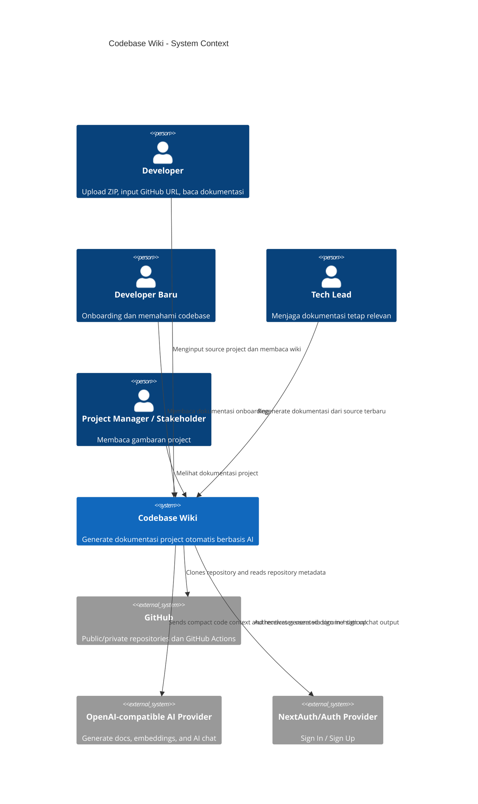
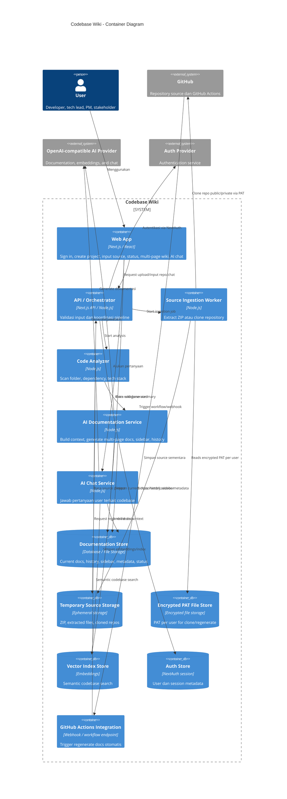

# C4 Model: Codebase Wiki

Dokumen ini merancang arsitektur awal Codebase Wiki berdasarkan `docs/prd/prd.md`.

## Scope

Codebase Wiki adalah platform dokumentasi otomatis berbasis AI. User dapat sign in, membuat project, lalu memasukkan source project melalui upload ZIP atau GitHub repository URL. Untuk private repository, user dapat memberikan GitHub Personal Access Token (PAT) dengan permission minimum read-only. PAT disimpan per user dalam encrypted file storage agar dapat dipakai untuk clone ulang dan regenerate docs. Sistem menganalisis struktur codebase, dependency, dan tech stack untuk menghasilkan dokumentasi multi-page wiki/Markdown seperti GitBook dengan sidebar otomatis.

## C1 - System Context

### Actors

- **Developer**: Menginput project, membaca dokumentasi, dan bertanya melalui AI chat.
- **Developer Baru**: Menggunakan dokumentasi untuk onboarding dan memahami codebase.
- **Tech Lead**: Menjaga dokumentasi project tetap relevan dengan codebase terbaru.
- **Project Manager / Stakeholder**: Membaca dokumentasi untuk memahami gambaran project tanpa membuka source code langsung.

### External Systems

- **GitHub**: Sumber repository public/private dan integrasi GitHub Actions.
- **GitHub Actions**: Trigger otomatis untuk regenerate dokumentasi ketika repository berubah.
- **AI Provider**: OpenAI-compatible API untuk generate dokumentasi, embeddings, dan AI chat.
- **NextAuth/Auth Provider**: Layanan autentikasi untuk Sign In / Sign Up.

### Context Diagram



## C2 - Container

### Containers

- **Web App**: UI untuk sign in, create project, input source, melihat status proses, membaca wiki multi-page, dan AI chat.
- **API / Orchestrator**: Backend utama untuk validasi input, job lifecycle, koordinasi ingestion/analyzer/generator, dan delivery hasil.
- **Source Ingestion Worker**: Mengambil source project dari ZIP atau GitHub repository dan menulisnya ke temporary storage.
- **Code Analyzer**: Membaca source dari temporary storage, memfilter file relevan, membaca dependency, dan mendeteksi tech stack.
- **AI Documentation Service**: Menyusun compact context, memanggil AI Provider, lalu menghasilkan docs, sidebar, history, dan embeddings.
- **AI Chat Service**: Menjawab pertanyaan user berdasarkan generated docs, metadata, dan vector search; tidak membaca raw source secara langsung.
- **Documentation Store**: Persistent store untuk current docs, docs history, generated sidebar, metadata project, dan job status.
- **Temporary Source Storage**: Ephemeral storage untuk ZIP, extracted source, dan cloned repository sebelum analisis.
- **Encrypted PAT File Store**: Secure credential store untuk PAT terenkripsi per user.
- **Vector Index Store**: Vector/embedding store untuk semantic codebase search dan grounding AI Chat.
- **Auth Store**: Store untuk session/user metadata dari NextAuth.
- **GitHub Actions Integration**: Workflow template + regenerate endpoint untuk automation dari GitHub Actions.

### Job Lifecycle

Lifecycle job utama yang harus didukung sistem:

- `queued`
- `uploading`
- `cloning`
- `extracting`
- `scanning`
- `generating`
- `completed`
- `failed`

### Container Diagram



## C3 - Component

### API / Orchestrator Components

- **Input Controller**: Menerima sign in session, create project, upload ZIP, GitHub URL, PAT, dan request chat.
- **Input Validator**: Validasi format ZIP, batas 50MB, URL GitHub, akses repository, dan PAT permission.
- **Job Coordinator**: Mengatur status proses: uploading, cloning, extracting, scanning, generating, completed, failed.
- **Project Metadata Manager**: Menyimpan metadata project, tech stack, dependency, docs history, sidebar, dan status generation.
- **Error Handler**: Menangani upload gagal, URL invalid, repository inaccessible, PAT invalid, extract gagal, dan AI failure.

### Source Ingestion Worker Components

- **Zip Extractor**: Mengekstrak file ZIP ke temporary source storage.
- **GitHub Clone Adapter**: Clone public/private repository dari GitHub.
- **PAT Credential Handler**: Mengambil PAT dari encrypted file storage, menggunakan PAT untuk akses private repo, dan mendukung revoke/delete oleh user pemilik.
- **Source Cleanup Task**: Membersihkan source sementara setelah proses selesai/gagal dengan fallback TTL 30 menit.

### Code Analyzer Components

- **Folder Scanner**: Membaca struktur folder dan file penting.
- **Exclude Filter**: Mengecualikan `node_modules`, `.git`, `.next`, `dist`, `build`, `coverage`, `.turbo`, cache, dan artifact besar yang tidak relevan.
- **Dependency Scanner**: Membaca dependency dari `package.json`, `requirements.txt`, atau file dependency lain.
- **Tech Stack Detector**: Mengidentifikasi framework dan library utama.
- **Context Builder**: Menyusun context codebase komprehensif untuk AI dengan filtering, chunking, dan batas ukuran payload.

### AI Documentation Service Components

- **Prompt Builder**: Membuat prompt berdasarkan codebase summary.
- **AI Provider Client**: Mengirim context ke OpenAI-compatible API dan menerima output.
- **Markdown Page Splitter**: Memecah output menjadi multiple Markdown pages per topik.
- **Sidebar Generator**: Membuat sidebar otomatis dari struktur halaman.
- **Documentation Publisher**: Menyimpan current docs, sidebar, dan history generation.
- **Embedding Indexer**: Membuat embeddings/vector index untuk semantic codebase search.

### AI Chat Service Components

- **Question Handler**: Menerima pertanyaan user terkait project.
- **Context Retriever**: Mengambil dokumentasi, metadata, dan hasil semantic search yang relevan.
- **Chat Prompt Builder**: Membuat prompt untuk menjawab pertanyaan berdasarkan context.
- **Chat Response Formatter**: Merapikan jawaban AI agar mudah dibaca user.

## C4 - Code Level

Untuk menjaga Level 4 tetap valid sebagai C4 code-level view, bagian ini hanya memecah **satu komponen inti**, yaitu **AI Documentation Service**. Komponen ini dipilih karena merupakan pusat value dari Codebase Wiki: menerima codebase summary, memanggil AI provider, memecah hasil menjadi multiple pages, membangun sidebar, menyimpan history, dan membuat embeddings untuk semantic search.

### Target Component

- **AI Documentation Service**

### Classes / Modules in Scope

- **PromptBuilder**: Menyusun prompt dokumentasi dari codebase summary.
- **AIProviderClient**: Adapter ke OpenAI-compatible API.
- **MarkdownFormatter**: Membersihkan output AI agar stabil dan konsisten.
- **MarkdownPageSplitter**: Memecah hasil dokumentasi menjadi multiple Markdown pages per topik.
- **SidebarGenerator**: Membuat sidebar navigasi otomatis dari hasil page split.
- **EmbeddingIndexer**: Membuat embeddings dari generated docs untuk semantic search.
- **DocumentationPublisher**: Menyimpan current docs, docs history, sidebar, dan metadata output.

### Code-Level Relationships

```text
ContextBuilder
  -> PromptBuilder
  -> AIProviderClient
  -> MarkdownFormatter
  -> MarkdownPageSplitter
  -> SidebarGenerator
  -> EmbeddingIndexer
  -> DocumentationPublisher
  -> DocumentationStore / VectorIndexStore
```

### Responsibilities

- **PromptBuilder** mengubah codebase summary menjadi prompt yang siap dikirim ke AI.
- **AIProviderClient** berkomunikasi dengan provider AI untuk menghasilkan draft dokumentasi.
- **MarkdownFormatter** membersihkan output AI sebelum dipublikasikan.
- **MarkdownPageSplitter** membagi output menjadi beberapa halaman Markdown.
- **SidebarGenerator** membangun struktur sidebar dari halaman yang sudah di-split.
- **EmbeddingIndexer** menyiapkan vector search untuk AI Chat.
- **DocumentationPublisher** menyimpan output final ke `Documentation Store` dan `Vector Index Store`.

### Out of Scope for C4 Level 4

Bagian berikut sengaja **tidak** dimasukkan ke code-level decomposition ini agar C4 Level 4 tidak berubah menjadi inventaris semua file:

- Web App modules
- Auth modules
- Full source ingestion pipeline
- Full analyzer pipeline
- GitHub Actions handler
- Semua storage implementation detail di luar dependency langsung komponen ini

### C4 Code Notes

- `AIProviderClient` hanya menerima compact context, bukan raw source penuh.
- `MarkdownPageSplitter` dan `SidebarGenerator` adalah kunci agar output terasa seperti GitBook.
- `EmbeddingIndexer` hanya berjalan setelah dokumen berhasil dihasilkan.
- `DocumentationPublisher` harus overwrite current docs tetapi tetap menyimpan history.

## Diagram Notes

- Di C2, detail seperti TTL cleanup, encrypted PAT, dan no logging sebaiknya dijelaskan melalui note/annotation, bukan dimasukkan semua ke label container utama.
- AI Chat harus digambarkan grounded pada `Documentation Store` dan `Vector Index Store`, bukan membaca raw source langsung.
- `Temporary Source Storage` hanya berada di jalur ingestion dan analyzer, bukan jalur chat.
- `Documentation Store` adalah persistent output store, sedangkan `Temporary Source Storage` adalah ephemeral working area.

## Security & Trust Boundaries

- PAT harus dianggap credential sensitif dan disimpan terenkripsi per user dalam encrypted file storage.
- PAT hanya boleh digunakan untuk akses repository milik user/project yang terkait.
- User pemilik harus dapat revoke/delete PAT.
- PAT tidak boleh ditampilkan kembali ke user atau ditulis ke log aplikasi.
- Source code yang diupload atau di-clone tidak boleh dieksekusi oleh sistem.
- Temporary source storage harus dibersihkan setelah job selesai/gagal dan punya fallback TTL cleanup 30 menit.
- ZIP upload dibatasi maksimal 50MB.
- Context yang dikirim ke AI harus melewati exclude filter, chunking, dan semantic retrieval agar tetap relevan dan tidak membanjiri model.

## Open Questions

- Format encrypted file storage untuk PAT per user.
- Storage final untuk docs history dan vector index.
- Detail workflow template GitHub Actions dan endpoint regenerate docs.
- Strategi chunking dan embedding untuk semantic codebase search.
- Apakah generated docs bisa diedit manual setelah dibuat.
