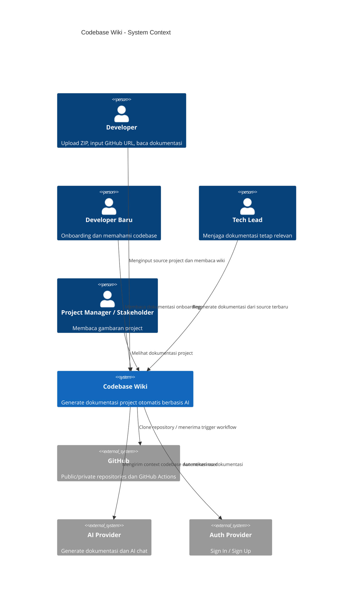
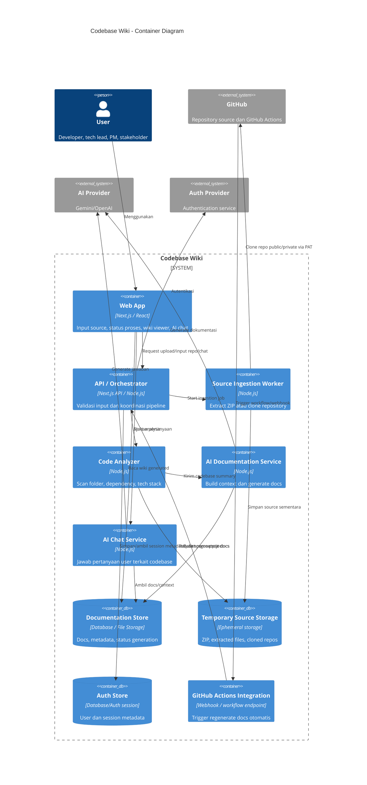

# C4 Model: Codebase Wiki

Dokumen ini merancang arsitektur awal Codebase Wiki berdasarkan `docs/prd/prd.md`.

## Scope

Codebase Wiki adalah platform dokumentasi otomatis berbasis AI. User dapat memasukkan source project melalui upload ZIP atau GitHub repository URL. Untuk private repository, user dapat memberikan GitHub Personal Access Token (PAT) dengan permission minimum read-only. Sistem lalu menganalisis struktur codebase, dependency, dan tech stack untuk menghasilkan dokumentasi wiki/Markdown.

## C1 - System Context

### Actors

- **Developer**: Menginput project, membaca dokumentasi, dan bertanya melalui AI chat.
- **Developer Baru**: Menggunakan dokumentasi untuk onboarding dan memahami codebase.
- **Tech Lead**: Menjaga dokumentasi project tetap relevan dengan codebase terbaru.
- **Project Manager / Stakeholder**: Membaca dokumentasi untuk memahami gambaran project tanpa membuka source code langsung.

### External Systems

- **GitHub**: Sumber repository public/private dan integrasi GitHub Actions.
- **GitHub Actions**: Trigger otomatis untuk regenerate dokumentasi ketika repository berubah.
- **AI Provider**: Layanan AI seperti Gemini atau OpenAI untuk generate dokumentasi dan menjawab pertanyaan codebase.
- **Email/Auth Provider**: Layanan autentikasi jika Sign In/Sign Up diaktifkan.

### Context Diagram



## C2 - Container

### Containers

- **Web App**: UI untuk upload ZIP, input GitHub URL/PAT, melihat status proses, membaca wiki, dan chat dengan AI.
- **API / Orchestrator**: Backend utama yang menerima input, validasi, koordinasi proses analisis, panggil AI, dan mengatur output dokumentasi.
- **Source Ingestion Worker**: Mengambil source project dari ZIP atau GitHub repository.
- **Code Analyzer**: Membaca struktur folder, file penting, dependency, dan tech stack.
- **AI Documentation Service**: Menyusun context ringkas dan memanggil AI Provider untuk generate dokumentasi.
- **AI Chat Service**: Menjawab pertanyaan user berdasarkan context codebase dan dokumentasi.
- **Documentation Store**: Menyimpan hasil dokumentasi, metadata project, dan status generation.
- **Temporary Source Storage**: Penyimpanan sementara untuk ZIP/extracted repo/clone repository sebelum dianalisis.
- **Auth Store**: Menyimpan data user/session bila Sign In/Sign Up digunakan.
- **GitHub Actions Integration**: Endpoint atau workflow integration untuk trigger regenerate dokumentasi otomatis.

### Container Diagram



## C3 - Component

### API / Orchestrator Components

- **Input Controller**: Menerima upload ZIP, GitHub URL, PAT, dan request chat.
- **Input Validator**: Validasi format ZIP, URL GitHub, akses repository, dan PAT permission.
- **Job Coordinator**: Mengatur status proses: uploading, cloning, extracting, scanning, generating, completed, failed.
- **Project Metadata Manager**: Menyimpan metadata project, tech stack, dependency, dan status generation.
- **Error Handler**: Menangani upload gagal, URL invalid, repository inaccessible, PAT invalid, extract gagal, dan AI failure.

### Source Ingestion Worker Components

- **Zip Extractor**: Mengekstrak file ZIP ke temporary source storage.
- **GitHub Clone Adapter**: Clone public/private repository dari GitHub.
- **PAT Credential Handler**: Menggunakan PAT untuk akses private repo tanpa menampilkan atau mencatat token ke log.
- **Source Cleanup Task**: Membersihkan source sementara setelah proses selesai atau timeout.

### Code Analyzer Components

- **Folder Scanner**: Membaca struktur folder dan file penting.
- **Dependency Scanner**: Membaca dependency dari `package.json`, `requirements.txt`, atau file dependency lain.
- **Tech Stack Detector**: Mengidentifikasi framework dan library utama.
- **Context Builder**: Menyusun ringkasan codebase untuk AI tanpa mengirim seluruh source code.

### AI Documentation Service Components

- **Prompt Builder**: Membuat prompt berdasarkan codebase summary.
- **AI Provider Client**: Mengirim context ke Gemini/OpenAI dan menerima output.
- **Markdown Formatter**: Merapikan output AI menjadi struktur wiki/Markdown.
- **Documentation Publisher**: Menyimpan dan menampilkan dokumentasi yang sudah digenerate.

### AI Chat Service Components

- **Question Handler**: Menerima pertanyaan user terkait project.
- **Context Retriever**: Mengambil dokumentasi dan metadata project yang relevan.
- **Chat Prompt Builder**: Membuat prompt untuk menjawab pertanyaan berdasarkan context.
- **Chat Response Formatter**: Merapikan jawaban AI agar mudah dibaca user.

## C4 - Code

Level C4 berikut adalah rancangan code-level untuk MVP. Karena implementasi belum dibuat, nama folder/file di bawah adalah arahan struktur yang disarankan agar container dan component di C2/C3 punya mapping jelas ke codebase.

### Suggested Code Structure

```text
apps/
├─ web/
│  ├─ app/
│  │  ├─ page.tsx
│  │  ├─ projects/[projectId]/page.tsx
│  │  └─ api/
│  │     ├─ projects/route.ts
│  │     ├─ ingest/route.ts
│  │     ├─ generate-docs/route.ts
│  │     └─ chat/route.ts
│  ├─ components/
│  │  ├─ SourceInputForm.tsx
│  │  ├─ GenerationStatus.tsx
│  │  ├─ WikiViewer.tsx
│  │  └─ ChatPanel.tsx
│  └─ lib/
│     ├─ api-client.ts
│     └─ markdown.ts
└─ api/
   ├─ src/
   │  ├─ controllers/
   │  │  ├─ input-controller.ts
   │  │  └─ chat-controller.ts
   │  ├─ services/
   │  │  ├─ job-coordinator.ts
   │  │  ├─ project-metadata-service.ts
   │  │  ├─ ai-documentation-service.ts
   │  │  └─ ai-chat-service.ts
   │  ├─ ingestion/
   │  │  ├─ zip-extractor.ts
   │  │  ├─ github-clone-adapter.ts
   │  │  ├─ pat-credential-handler.ts
   │  │  └─ source-cleanup-task.ts
   │  ├─ analyzer/
   │  │  ├─ folder-scanner.ts
   │  │  ├─ dependency-scanner.ts
   │  │  ├─ tech-stack-detector.ts
   │  │  └─ context-builder.ts
   │  ├─ ai/
   │  │  ├─ prompt-builder.ts
   │  │  ├─ ai-provider-client.ts
   │  │  ├─ markdown-formatter.ts
   │  │  └─ documentation-publisher.ts
   │  ├─ storage/
   │  │  ├─ documentation-store.ts
   │  │  ├─ temporary-source-storage.ts
   │  │  └─ auth-store.ts
   │  └─ integrations/
   │     └─ github-actions-handler.ts
```

### Key Classes / Modules

#### Input Flow

- **SourceInputForm**: UI untuk upload ZIP, input GitHub URL, dan optional PAT.
- **InputController**: Entry point API untuk menerima source project.
- **InputValidator**: Validasi ZIP, GitHub URL, repository accessibility, dan PAT permission.
- **JobCoordinator**: Membuat job, menyimpan status, dan memanggil ingestion/analyzer/generator.

#### Source Ingestion

- **ZipExtractor**: Mengekstrak ZIP ke temporary source storage.
- **GitHubCloneAdapter**: Clone public/private repository dari GitHub.
- **PATCredentialHandler**: Menggunakan PAT secara read-only tanpa logging token.
- **SourceCleanupTask**: Menghapus source sementara setelah job selesai atau timeout.

#### Code Analysis

- **FolderScanner**: Membaca struktur folder dan file penting.
- **DependencyScanner**: Membaca dependency dari `package.json`, `requirements.txt`, dan file dependency lain.
- **TechStackDetector**: Mengidentifikasi framework/library utama.
- **ContextBuilder**: Membuat context ringkas untuk AI agar tidak mengirim seluruh source code.

#### AI Documentation

- **PromptBuilder**: Membuat prompt dokumentasi dari context project.
- **AIProviderClient**: Adapter ke Gemini/OpenAI.
- **MarkdownFormatter**: Merapikan output AI menjadi Markdown/wiki.
- **DocumentationPublisher**: Menyimpan hasil dokumentasi dan membuatnya tersedia untuk Web App.

#### Wiki & Chat

- **WikiViewer**: Render dokumentasi Markdown ke UI.
- **ChatPanel**: UI tanya jawab terkait project.
- **AIChatService**: Menjawab pertanyaan berdasarkan generated docs dan project metadata.
- **ContextRetriever**: Mengambil context relevan dari Documentation Store.

### Code-Level Flow

```text
SourceInputForm
  -> InputController
  -> InputValidator
  -> JobCoordinator
  -> ZipExtractor / GitHubCloneAdapter
  -> TemporarySourceStorage
  -> FolderScanner / DependencyScanner / TechStackDetector
  -> ContextBuilder
  -> PromptBuilder
  -> AIProviderClient
  -> MarkdownFormatter
  -> DocumentationPublisher
  -> DocumentationStore
  -> WikiViewer
```

### C4 Code Notes

- `temporary-source-storage.ts` harus hanya menyimpan source sementara dan punya cleanup policy.
- `pat-credential-handler.ts` tidak boleh menulis PAT ke log atau menyimpan token tanpa enkripsi.
- `context-builder.ts` harus membatasi context yang dikirim ke AI.
- `github-actions-handler.ts` dapat menjadi nice-to-have untuk trigger regenerate docs dari workflow.
- `ai-chat-service.ts` dapat diposisikan sebagai bonus jika MVP utama belum selesai.

## Security & Trust Boundaries

- PAT harus dianggap credential sensitif.
- PAT hanya boleh digunakan untuk akses repository yang diminta user.
- PAT tidak boleh ditampilkan kembali ke user atau ditulis ke log aplikasi.
- Jika PAT perlu disimpan untuk penggunaan ulang, token harus dienkripsi dan memiliki lifecycle yang jelas.
- Source code yang diupload atau di-clone tidak boleh dieksekusi oleh sistem.
- Temporary source storage harus memiliki cleanup policy.
- Context yang dikirim ke AI sebaiknya berupa ringkasan struktur, dependency, dan file penting, bukan seluruh source code.

## Open Questions

- Apakah MVP harus menyimpan PAT secara persistent atau cukup digunakan sementara saat request berjalan?
- Apakah GitHub Actions integration untuk hackathon cukup berupa workflow template atau perlu endpoint webhook penuh?
- Apakah Codebase Wiki menyimpan hasil dokumentasi ke database atau cukup file/temporary storage untuk demo?
- Apakah AI Chat masuk MVP, nice-to-have, atau demo bonus?
- Apakah Sign In/Sign Up wajib untuk MVP atau cukup disiapkan sebagai future capability?
